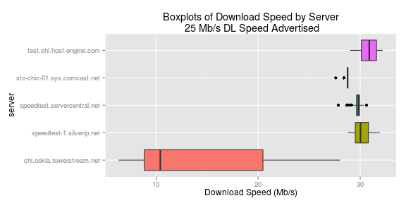

<!-- Limit image width and height -->
<style type='text/css'>
img {
    max-height: 500px;
    max-width: 800px;
}
</style>

<!-- Center image on slide -->
<script src="http://ajax.aspnetcdn.com/ajax/jQuery/jquery-1.7.min.js"></script>
<script type='text/javascript'>
$(function() {
    $("p:has(img)").addClass('centered');
});
</script>    

## Introduction

* An [internet speed monitoring app](https://klimburg.shinyapps.io/InternetSpeedDash/) built in the Shiny web framework for R. 
* The data is collected using [Janhouse/tespeed](https://github.com/Janhouse/tespeed) python tool which allows internet speed testing via http://www.speedtest.net from a command line interface.
* This application was built as a project for the Coursera Data Science Specialization Developing Data Products class.
* The source files can all be found at [https://github.com/klimburg/InternetSpeedDash](https://github.com/klimburg/InternetSpeedDash).

---

## Features

* Application displays time series and histogram of download and upload speeds.
* Filterable by date, internet plan speed and server.


---

## Compare Actual vs. Advertised 

* Do you wonder if you are getting the speeds that you pay for?
* Compare actual vs. advertised speeds


---

## Limitations

It should be noted that other factors besides the advertised speed of your internet plan may affect the recorded speeds, such as the server responsible for the content.

An example of this can be seen when looking at the speeds by server when I had Comcast's 25 Mbit/Sec download speed. 

```{r slowServer, echo=FALSE, fig.keep='none', warning=FALSE, message=FALSE}
library(dplyr)
library(ggplot2)

df<-read.csv(file = "../data/speedtest.csv", header = F)
names(df) <- c("date.time", "Download", "Upload", "units", "server")
df$date.time <- as.POSIXct(df$date.time, origin = '1970-01-01')
df$server <- str_replace_all(df$server,pattern = "\\[\\'http:\\/\\/","")
df$server <- str_replace_all(df$server,pattern = "\\/speedtest\\/\\'\\]","")
df$server <- as.factor(df$server)
df$units<-paste0(df$units,"/sec")
df$ad.speed<-ifelse(df$date.time>as.POSIXct('2014-09-23 13:00:00'),105,25)

minServer<-df%>%filter(ad.speed == 25)%>%
    group_by(server)%>%summarise(median = median(Download),
                                 stdev = sd(Download))%>%head(1)

df.plot<-df%>%filter(ad.speed == 25)
p1<-ggplot(df.plot)+
    geom_boxplot(aes(x=server,y=Download, fill = server))+
    labs(y="Download Speed (Mb/s)", title = "Boxplots of Download Speed by Server\n 25 Mb/s DL Speed Advertised")+
    theme(legend.position = "none")+
    coord_flip()
ggsave("/home/kevin/Coursera/DataSci/DataProds/InternetSpeedDash/Internet-Speed-Dashboard-Pres/assets/img/boxplot1.png",p1,width = 8, height = 4, dpi = 72)
```


The plot shows that the `r  as.character(minServer$server)` server behaves differently from the rest, with a median download speed of `r minServer$median` Mb/s while the others have median values of approximately 30 Mb/s. 

---

## Future Improvements

Many improvements could be added to improve this application:
* Add a predictive forecast for future speeds, factors could include day of the week and time of day.
* Add boxplots and other exploratory analysis tools

Some improvements would require more modifications of tespeed.py or the cronjob running it
* Track ping speed
* Take measurements from multiple servers on each attempt to allow comparisions across servers at the same time
* Automate pushing new data to shinyapps.io on a regular basis


