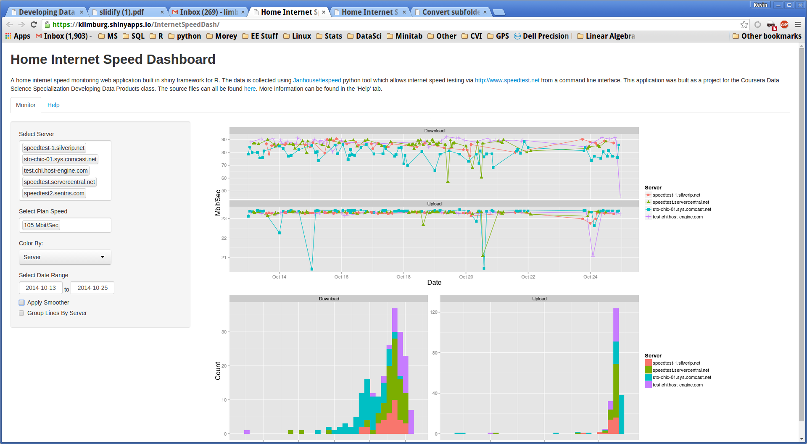

<!-- Limit image width and height -->

<!-- Center image on slide -->

    

## Introduction

* An internet speed monitoring app built in the Shiny web framework for R. 
* The data is collected using [Janhouse/tespeed](https://github.com/Janhouse/tespeed) python tool which allows internet speed testing via http://www.speedtest.net from a command line interface.
* This application was built as a project for the Coursera Data Science Specialization Developing Data Products class.
* The source files can all be found at [https://github.com/klimburg/InternetSpeedDash](https://github.com/klimburg/InternetSpeedDash).

---

## Features

* Application displays time series and histogram of download and upload speeds.
* Filterable by date, internet plan speed and server.

---

## Compare Actual vs. Advertised 

* Do you wonder if you are getting the speeds that you pay for?
* Compare actual vs. advertised speeds

---

## Slide 4

---

## Slide 5

